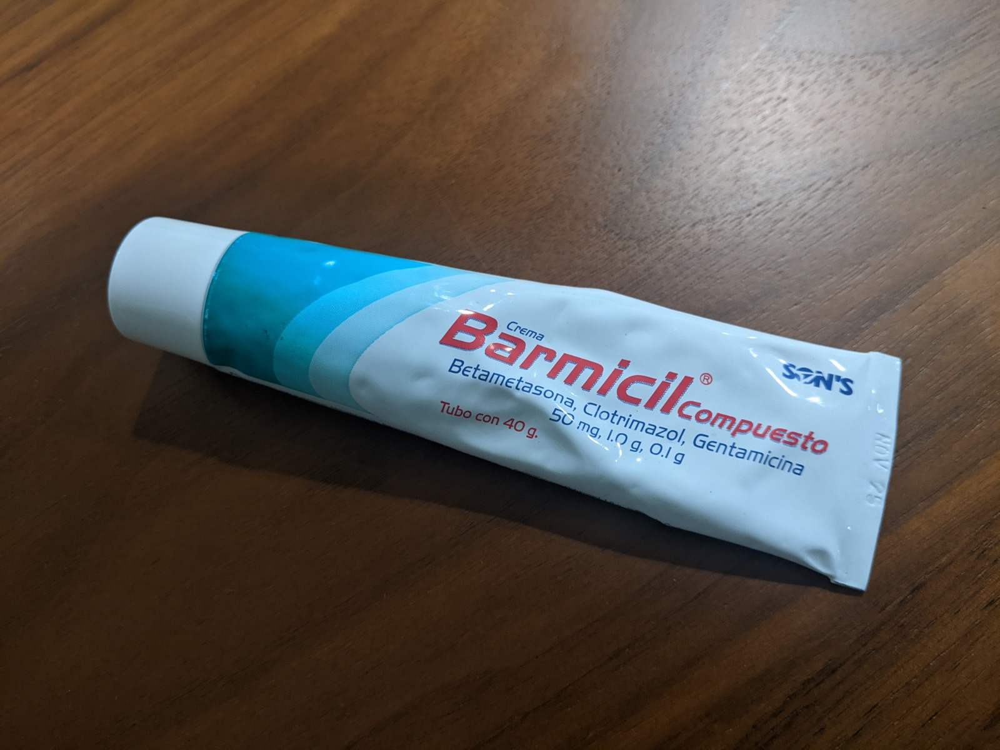

# Caring for Aitor

## Daily Routine 

### Morning
- Feed 1.25 cups of dry [food](#food)
- [Walk](#walks) for 15-25 minutes (pee + poo)

### Evening
- Feed 1.25 cups of dry [food](#food)
- [Walk](#walks) for 15-25 minutes (pee + poo) (This walk can be longer)
- [Play](#play) with him for 15-20 minutes. 

### Night
- 1-2 [eye drops](#eyes) in each eye
- Give [skin](#skin) vitamin treat
- Put cream on any irritation on [skin](#skin)

## Food
Feed 1.25 cups of dry food in the morning and 1.25 cups in the evening.

- You can treat him with cut carrots or cut apples. 
- You can also treat him with a small piece of the green treats (Maximum 10 per day).
- If he is very energetic, you can give him calming treats. (MAXIMUM 3 per day)
- Don't feed CHOCOLATE or GRAPES and avoid giving him human food.

## Walks
Walk twice per day. He likes longer walks but gets tired very quickly. If the day is warm, do very short walks and give him plenty of water. 

<video autoplay loop muted>
  <source src="assets/vest.mp4" type="video/mp4">
</video>

If you are planning on taking him out on a longer walk, you can use his stroller. He can walk for 15 minutes and then hop on the stroller.

**CAUTION** When walking, always take water and be checking that his temperature and breathing are normal. This breed is very sensitive to heat shock so its good to exagerate in keeping him cool and calm.

## Skin 
If any rash or bald spot appears, apply a little bit of Barmicil on the spot once per day until you see it go away.

<video autoplay loop muted>
  <source src="assets/cream.mp4" type="video/mp4">
</video>

Give one skin treat with vitamins every night. This can be a treat for him allowing to put on the cream and the [eye drops](#eyes). 

## Eyes
Put an eye drop in each eye once per day. Its best to put the drops when he is laying down and calm. You can give a skin treat after putting them. 

<video autoplay loop muted>
  <source src="assets/eye_drops.mp4" type="video/mp4">
</video>

## Ears
Clean once per week. Use a cotton ball and ear cleaning solution.

## Play

- Fetch 
    - Throw a ball and give treats sporadicaly when he brings the ball back and leaves it on the floor. 
- Tug of war
    <video autoplay loop muted>
        <source src="assets/fetch.mp4" type="video/mp4">
    </video>
    - Allow him to grab rope and try to pull it from you. 
    - Don't pull very hard as it can damage his teeth. 
    - Give space between your hand and his mouth so he does'nt accidentaly bite you while playing. 
- Chase the ball
    - Ahow him tennis ball. Tease him with it but don't let him grab it.

## Emergency
- Something in his mouth that should not be there (food, metal objects, pointy objects, plastics)
    - Distract him with a treat and grab the object while he goes for the treat. If he doesn't leave the object, look for a more interesting treat. In majot cases, you can put his food plate with a scoop of food and he will leave the object.

## Playful emergencies

### Stealing Objects
Aitor might grab a towel, shoe or other fun objects to play with you. If he grabs anything that he should not have grabbed, do not attempt to take it away from him. He can bite. Instead, distract him with a treat. You can oplace the treat one meter away and he will eventually leave the object and grab the treat. You can grab the object while he goes for the treat. 

### Barking at you while eating
If he barks at you while sitting down, it might be a sign that he wants to play. You can refer to the three types of play that he likes. Playing for 10-15 will drain a lot of his energy and he'll go back to his bed. 

### Bitting his bed and blanket
If he bites his bed and/or blanket. You can distract him and lay the blanket nicely on his bed. This will make him go to bed again. You can also put the blanket on him and he will lay down.

## Bad Behavior

### Continuouslu Barking at humans
You can play with him, give him treats and distract him. If he continues to bark, you can put him in his bed and cover him with his blanket. He will eventually go to sleep.

### Biting hands
Don't attempt to take away a ball or food that is in his mouth. He can bite. If he shows intention to bite remove hand immedeately and say a firm no. If he continues you can walk away from him. He usually bites if he is under stress or if he wants to be left alone. 

### Biting feet
He can bite your feet before going on a walk. This will only occur when he is crossing the door. To avoid this, you can [put his vest on while he is eating](#walks). If he has the vest on after eating, he will be ready to go for a walk calmly. 

If he randomly bites feet, stay calm, pull feet away and say no firmly. His bite is never strong nor with the goal of hurting. 

The best way to make him stop any bad behavior is to distract him with another thing. It can be a toy, a treat or a walk.