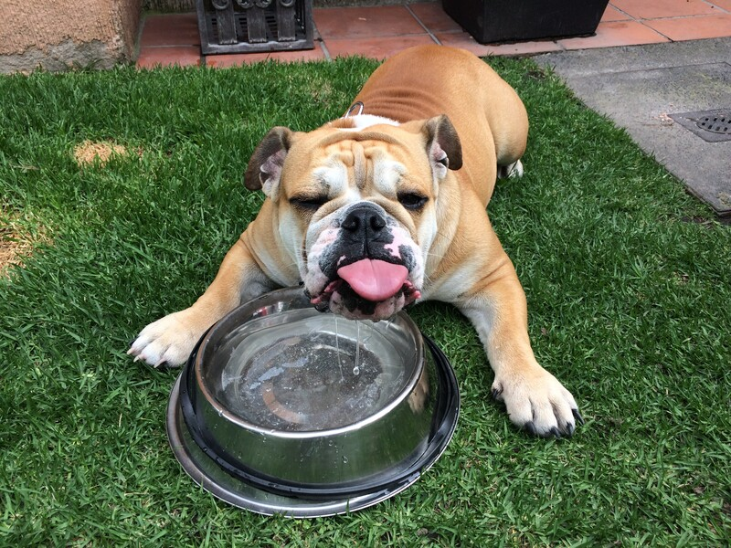

# Caring for Aitor

## Food
Feed 1.25 cups of dry food in the morning and 1.25 cups in the evening.

Give skin vitamin treat for the evening meal. 

## Walks
Walk twice per day. He likes longer walks but gets tired very quickly. If the day is warm, do very short walks and give him plenty of water. 

## Skin 
If any rash or bald spot appears, apply Barmicil on the spot once per day until you see it go away. 

## Eyes
Put an eye drop in each eye once per day. Its best to put the drops when he is laying down and calm.

<video autoplay loop muted>
  <source src="assets/eye_drops.mp4" type="video/mp4">
</video>

## Ears
Clean once per week. Use a cotton ball and ear cleaning solution.

## Play

- Fetch 
    - Throw a ball and give treats sporadicaly when he brings the ball back and leaves it on the floor. 
- Tug of war
    - Allow him to grab rope and try to pull it from you. 
    - Don't pull very hard as it can damage his teeth. 
    - Give space between your hand and his mouth so he does'nt accidentaly bite you while playing. 
- Chase the ball
    - Ahow him tennis ball. Tease him with it but don't let him grab it.

## Playful emergencies

### Stealing Objects
Aitor might grab a towel, shoe or other fun objects to play with you. If he grabs anything that he should not have grabbed, do not attempt to take it away from him. He can bite. Instead, distract him with a treat. You can oplace the treat one meter away and he will eventually leave the object and grab the treat. You can grab the object while he goes for the treat. 

### Barking at you while eating
If he barks at you while sitting down, it might be a sign that he wants to play. You can refer to the three types of play that he likes. Playing for 10-15 will drain a lot of his energy and he'll go back to his bed. 

### Bitting his bed and blanket
If he bites his bed and/or blanket. You can distract him and lay the blanket nicely on his bed. This will make him go to bed again. You can also put the blanket on him and he will lay down.

